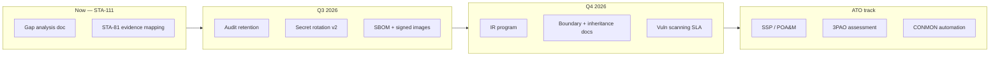

# FedRAMP Moderate — Control Gap Assessment & Roadmap (STA-111)

**Status:** Readiness documentation only — not a FedRAMP authorization package or 3PAO assessment.  
**Baseline:** NIST SP 800-53 Rev. 5 control families at **FedRAMP Moderate** impact level.  
**Product scope:** Gravitre Operator AI (multi-tenant SaaS + optional single-tenant Helm/VPC deploy per STA-85).  
**Related work:** [STA-81](https://linear.app/staqbot/issue/STA-81) SOC2 evidence export, [STA-82](https://linear.app/staqbot/issue/STA-82) PII redaction, [STA-83](https://linear.app/staqbot/issue/STA-83) SIEM streaming.

---

## 1. Executive summary

Gravitre has **strong technical foundations** for auditability, access control, and data handling suitable for regulated customers. FedRAMP Moderate authorization requires additional **organizational controls**, **continuous monitoring artifacts**, **formal SSP/POA&M processes**, and **infrastructure boundary evidence** that sit partly outside the application codebase.

| Readiness band | Approx. share of Moderate baseline | Notes |
|----------------|-----------------------------------|--------|
| **Implemented (product)** | ~45% | Audit logs, RBAC, SSO/SCIM, encryption at rest for connector/SIEM secrets, data residency, model policy, SIEM export |
| **Partial (product + process)** | ~30% | Retention, DR, key rotation, vulnerability management — designed but not fully automated |
| **Gap (organizational / ATO)** | ~25% | SSP, CONMON, 3PAO, physical/PE inherited from cloud providers, personnel security program |

**Recommendation:** Pursue FedRAMP as a **customer-driven ATO path** (agency sponsor or JAB provisional) only after closing P0 product gaps below and standing up a GRC program. Use STA-81 exports as the primary **continuous evidence feed** during pre-ATO.

---

## 2. Assessment methodology

1. Map each NIST 800-53 Moderate control family to Gravitre **product capability**, **operational process**, or **inherited cloud control**.
2. Classify status:
   - **Implemented** — evidence available today via API, audit logs, or runbooks.
   - **Partial** — capability exists but incomplete automation, retention, or documentation.
   - **Gap** — not implemented; requires engineering or organizational work.
   - **Inherited** — satisfied by Supabase, Railway, Vercel, or customer VPC/K8s when deployed per STA-85.
3. Tie product evidence to **STA-81 export bundles** and complementary exports listed in §3.

---

## 3. Evidence collection (STA-81 mapping)

### Primary export — SOC2 evidence bundle (STA-81)

```http
GET /api/enterprise/compliance/soc2-export?from=2026-01-01T00:00:00Z&to=2026-06-30T23:59:59Z
Authorization: Bearer <admin-token>
```

Response structure (`build_soc2_evidence_bundle` in `backend/app/services/compliance_service.py`):

| Bundle section | FedRAMP families supported | Example controls |
|----------------|---------------------------|------------------|
| `controls.auditLogs` | AU, SI, CA | AU-2, AU-3, AU-6, AU-12, SI-4 |
| `controls.toolInvocations` (`tool.invoke.*`) | AU, AC, SI | AU-2, AC-2(4), SI-7 |
| `controls.connectorChanges` (`connector.*`, OAuth) | CM, AC, IA | CM-3, AC-3, IA-5 |
| `controls.adminActions` (`settings.*`, `enterprise.*`, `sso.*`) | AC, CM, PL | AC-2, AC-6, CM-6 |

All string metadata is **PII-redacted** (strict mode) per STA-82 before export.

### Supplementary exports (same assessment window)

| Export | Endpoint | FedRAMP use |
|--------|----------|-------------|
| SIEM stream config | `GET /api/enterprise/siem` + `POST /api/enterprise/siem/test` | AU-6(1), SI-4, IR-4 (when SIEM is customer SOC) |
| EU AI Act transparency | `GET /api/enterprise/transparency-logs/export` | AU-2 supplement for automated decisions (STA-112) |
| Data residency | `GET /api/enterprise/data-region` | SC-7, CP-9 (data location attestation) |
| Execution region | `GET /api/enterprise/execution-region` | SC-7 (processing boundary) |
| HIPAA controls | `GET /api/enterprise/hipaa` | AC-3, SC-28 (PHI handling — healthcare track) |
| Audit query API | `GET /api/audit` | AU-6 ad-hoc investigation |
| SSO / SCIM | `/api/auth/sso/*`, `/scim/v2/*` | IA-2, IA-4, AC-2 |

### Recommended quarterly evidence package

1. SOC2 bundle (STA-81) — full window.
2. Transparency export (STA-112) — if autonomous operators enabled.
3. SIEM delivery test receipt — screenshot or webhook payload hash.
4. Helm values + NetworkPolicy manifest (STA-85 VPC customers).
5. `docs/phase-5/SECRETS_ROTATION_PLAN.md` execution log (when rotation is performed).

---

## 4. Control family assessment

Legend: **I** = Implemented, **P** = Partial, **G** = Gap, **H** = Inherited (cloud/customer)

| Family | Status | Gravitre capability | STA-81 / evidence | Gap / roadmap |
|--------|--------|---------------------|-------------------|---------------|
| **AC** Access Control | P | Org RBAC (`admin`/`member`), agent tool permissions, approval gates, HIPAA tool blocks, model allowlist (STA-90) | `adminActions`, `tool.invoke.failed` (permission_denied) | Fine-grained ABAC; periodic access reviews (organizational) |
| **AT** Awareness & Training | G | — | — | Security awareness program, role-based training records |
| **AU** Audit & Accountability | I | `audit_logs` table, workflow/operator/tool events, SIEM export (STA-83) | Full bundle; `tool.invoke.*`, `workflow.*`, `enterprise.*` | Automated retention rollups ([AUDIT_RETENTION_STRATEGY.md](../phase-5/AUDIT_RETENTION_STRATEGY.md)) |
| **CA** Assessment & Authorization | G | SOC2 export supports assessor sampling | Periodic STA-81 pulls | Formal SSP, SAR, POA&M, 3PAO assessment |
| **CM** Configuration Management | P | Helm chart (STA-85), env-based config, kill switches | `settings.*`, `enterprise.*` admin actions | Baseline CMDB, change tickets for prod deploys |
| **CP** Contingency Planning | P | Workflow DR runbook (STA-95), Redis queue HA (STA-94) | Run execution logs | Game-day tests, RTO/RPO metrics, geo-redundant backups |
| **IA** Identification & Authentication | I | Supabase JWT validation, SSO SAML/OIDC (STA-86), SCIM provisioning | `sso.*` admin actions | MFA enforcement policy (org-configurable via IdP) |
| **IR** Incident Response | P | Audit + SIEM feed, structured logging standard | SIEM test event, auditLogs | IR playbooks, on-call, customer notification SLAs |
| **MA** Maintenance | H | — | — | Inherited from cloud provider; customer VPC patch cadence |
| **MP** Media Protection | P | Connector token encryption (Fernet), SIEM secret encryption (STA-83) | connector OAuth audit events | Key rotation automation ([SECRETS_ROTATION_PLAN.md](../phase-5/SECRETS_ROTATION_PLAN.md)) |
| **PE** Physical & Environmental | H | — | — | Inherited from Supabase / AWS / Railway / Vercel |
| **PL** Planning | P | Phased module plan, integration backlog | — | Formal System Security Plan (SSP) document set |
| **PM** Program Management | G | — | — | FedRAMP PMO, continuous monitoring program |
| **PS** Personnel Security | G | — | — | Background checks, termination access revocation process |
| **RA** Risk Assessment | P | Policy engine, guardrails, model policy | guardrail_events (via DB) | Annual risk assessment, threat modeling cadence |
| **SA** System & Services Acquisition | P | Connector SDK review, marketplace sandbox | marketplace audit actions | Vendor SSP inheritance letters (Supabase, OpenAI, etc.) |
| **SC** System & Communications Protection | P | TLS in transit, data residency (STA-80), execution region (STA-93), VPC deploy | data-region API, Helm NetworkPolicy | FIPS-validated crypto modules (customer requirement); mTLS service mesh |
| **SI** System & Information Integrity | P | AI guardrails, rate limits, PII redaction (STA-82), compensation on failure (STA-107) | tool.invoke.failed, guardrail_events | Vuln scanning CI gate, signed container images, SBOM |

---

## 5. Priority gap backlog (product & platform)

### P0 — Required before any FedRAMP customer conversation

| Item | Control touchpoints | Owner | Target |
|------|---------------------|-------|--------|
| Implement audit retention rollups + export-before-delete | AU-11, AU-4 | Platform | Q3 2026 |
| Dual-key connector secret rotation (design → code) | SC-12, SC-28 | Security | Q3 2026 |
| Container image signing + provenance (SBOM in CI) | SI-7, SA-10 | DevOps | Q3 2026 |
| Document inherited controls matrix (Supabase, Railway, Vercel) | CA, PE, SC | GRC | Q2 2026 |

### P1 — Required for Moderate ATO path

| Item | Control touchpoints | Owner | Target |
|------|---------------------|-------|--------|
| Continuous vulnerability scanning (deps + images) with SLA | RA-5, SI-2 | Security | Q4 2026 |
| Formal IR runbook + tabletop exercise record | IR-4, IR-8 | GRC | Q4 2026 |
| SSO-enforced MFA policy documentation | IA-2(1) | GRC + IdP | Q4 2026 |
| FedRAMP Moderate boundary diagram (SaaS + VPC variants) | AC-20, SC-7 | Architecture | Q4 2026 |

### P2 — Optimization / JAB-ready

| Item | Control touchpoints | Owner | Target |
|------|---------------------|-------|--------|
| CONMON automation dashboard fed by STA-81 exports | CA-7 | GRC | 2027 |
| FIPS 140-2 validated module option for VPC deploy | SC-13 | Platform | Customer-specific |
| Agency-specific control overlays (e.g. IRS, DoD) | All | GRC | Per sponsor |

---

## 6. STA-81 action prefix → control quick reference

Use these filters when sampling `controls.auditLogs` from the SOC2 export:

| Audit prefix | FedRAMP relevance |
|--------------|-------------------|
| `tool.invoke.*` | AU-2, AC-3 — who invoked what external integration |
| `workflow.execute.*` | AU-2, CP-2 — automation execution trail |
| `workflow.compensation.*` | SI-7 — rollback / integrity after failure (STA-107) |
| `enterprise.hipaa.*` | AC-3, SC-28 — regulated data mode changes (STA-110) |
| `enterprise.transparency.*` | AU-2 — automated decision logging (STA-112) |
| `enterprise.siem.*` | AU-6 — log forwarding configuration |
| `sso.*` / SCIM provision events | IA-4, AC-2 |
| `settings.model_policy.*` | AC-3, SA-8 — AI model allowlist (STA-90) |
| `operator.auto_execute.*` | AC-6, AU-2 — autonomous action policy (STA-106) |

---

## 7. Deployment models

### Multi-tenant SaaS (default)

- **Boundary:** Gravitre app + Supabase Postgres + Railway API + Vercel web.
- **Inherited controls:** Physical, environmental, hypervisor — cloud providers.
- **Customer evidence:** STA-81 export, data-region attestation, SIEM forwarding.

### Single-tenant VPC (STA-85 Helm)

- **Boundary:** Customer K8s namespace; customer-managed Postgres/Redis optional.
- **Additional evidence:** `deploy/enterprise/helm` values, NetworkPolicy, customer IR integration.
- **FedRAMP note:** Many agency ATOs prefer this model; inherit fewer controls from public SaaS.

See [deploy/enterprise/README.md](../../deploy/enterprise/README.md).

---

## 8. Roadmap summary



---

## 9. Out of scope (explicit)

- FedRAMP authorization decision or agency sponsorship
- 3PAO assessment scheduling
- Full System Security Plan (SSP) authorship — use this gap analysis as input only
- Control implementation for customer-owned IdP, SIEM, or VPC unless contracted

---

## 10. References

| Doc / API | STA | Purpose |
|-----------|-----|---------|
| `GET /api/enterprise/compliance/soc2-export` | STA-81 | Primary evidence bundle |
| [agent-transparency-logs.md](../integration/agent-transparency-logs.md) | STA-112 | Automated decision records |
| [agent-hipaa-controls.md](../integration/agent-hipaa-controls.md) | STA-110 | PHI / BAA controls |
| [TIER4_PRODUCTION_SMOKE.md](../integration/TIER4_PRODUCTION_SMOKE.md) | STA-80–86 | Verification checklist |
| [AUDIT_RETENTION_STRATEGY.md](../phase-5/AUDIT_RETENTION_STRATEGY.md) | — | AU-11 design |
| [SECRETS_ROTATION_PLAN.md](../phase-5/SECRETS_ROTATION_PLAN.md) | — | SC-12 rotation design |
| [workflow-dr-runbook.md](../integration/workflow-dr-runbook.md) | STA-95 | CP contingency |

**Linear:** [STA-111](https://linear.app/staqbot/issue/STA-111) · Depends on [STA-81](https://linear.app/staqbot/issue/STA-81)
