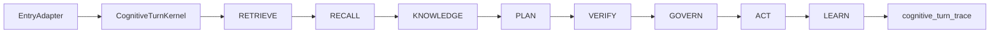
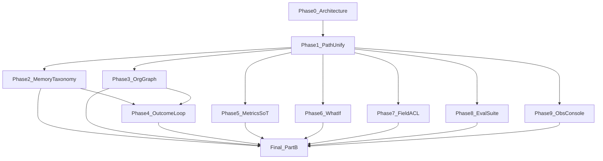

# CognitiveTurnKernel — binding architecture (Phase 0)

**Status:** Binding design — approved for gated implementation by execution of the One Brain plan  
**Date:** 2026-08-13  
**Product:** Gravitre  
**Parent audit:** [`cognitive-system-proposal-reconciliation-2026-08.md`](./cognitive-system-proposal-reconciliation-2026-08.md)  
**Update rule:** Append dated sections when stage contracts, adapters, or evidence bars change. Do not overwrite Part A/B of the reconciliation audit.

---

## 1. Problem this architecture solves

There is no single cognitive kernel today. Chat LIVE runs **before** full memory/company/entity assembly; jobs/swarm get retrieve without LIVE; extension enrich/actions and Meson interpret bypass cognitive assembly. Same user intent can get inconsistent memory, honesty, and governance.

**Locked product decisions**

| Decision | Scope |
|----------|--------|
| Cross-conversation memory | **Org/workspace only** — never cross-org; compose with RLS + KF platform-shared vs customer-private |
| Fuzzy person-name embeddings (Option C) | **Still out** — promotions + typed memories only |
| Metrics SoT, what-if (honest), field ACL, closed outcome loop, unified eval, per-run console | In scope in later phases |

---

## 2. Mandatory thinking sequence

Every NL / agent / write-confirm turn enters:

```text
CognitiveTurnKernel.run(request) -> CognitiveTurnResult
```

| Stage | Name | Responsibility | Skip allowed? |
|-------|------|----------------|---------------|
| 1 | RETRIEVE | Identity: org_id, user_id, agent_id, conversation_id, surface, entry_point, seat/dept | No |
| 2 | RECALL | Org-scoped memory pack (working, episodic, preference, decision, outcome, relationship, procedural) | No (empty pack OK) |
| 3 | KNOWLEDGE | Merged: Knowledge Fabric + capability ontology + org knowledge graph | No (empty OK) |
| 4 | PLAN | One CognitivePlanner → `current_plan` schema | No for NL/agent; Meson adapters emit same schema |
| 5 | VERIFY | Mandatory VerificationCritic (+ batch degeneracy) before consequential output / write proposal | No for consequential; advisory-only replies still record a verify noop |
| 6 | GOVERN | catalog_write_authority (+ field ACL when Phase 7 ships); HITL tokens are outputs | No for writes |
| 7 | ACT | Strategy only: LIVE, classical orch/connector, ReAct tools, enrich response, workflow agent step | Strategy choice, not alternate brain |
| 8 | LEARN | finalize_execution_outcome + outcome events; Phase 4 closes into PLAN bias | No after ACT completes |

Every stage appends to `cognitive_turn_trace` (persisted).



---

## 3. Stage I/O contracts

### 3.1 CognitiveTurnRequest

| Field | Type | Notes |
|-------|------|-------|
| org_id | uuid | Required |
| user_id | uuid \| null | Actor |
| agent_id | uuid \| null | |
| conversation_id | uuid \| null | |
| message | str | User / task text |
| surface | str | `ai_chat` \| `agent_chat` \| `voice` \| `extension_chat` \| `extension_enrich` \| `extension_action` \| `job` \| `swarm` \| `council` \| `workflow_agent` \| `confirm_write` |
| entry_point | str | Stable adapter id |
| environment_name | str | default production |
| spoken_mode | bool | |
| intent | str | `chat` \| `enrich` \| `write_confirm` \| `job` \| … |
| parameters | dict | Opaque surface params |
| task_state | dict \| null | Module B state |
| conversation_history | list \| null | |
| client | Supabase client | |

### 3.2 CognitiveTurnContext (accumulates)

| Field | Populated by |
|-------|----------------|
| identity | RETRIEVE |
| memory_pack | RECALL — `{working, episodic, preference, decision, outcome, relationship, procedural, prompt_section}` |
| knowledge_pack | KNOWLEDGE — `{fabric_chunks, catalog_hints, entity_graph, prompt_section}` |
| plan | PLAN — `current_plan` compatible |
| verify | VERIFY — critic dict |
| govern | GOVERN — `{requires_approval, confirmation_token?, blocked?, reason?}` |
| act | ACT — stream events / AgentResult / enrich payload |
| learn | LEARN — outcome ids |
| stages | list of `{stage, ok, ms, meta}` |

### 3.3 CognitiveTurnResult

| Field | Notes |
|-------|-------|
| turn_id | uuid — correlates with cognitive_turn_trace |
| context | CognitiveTurnContext |
| stream_or_result | Surface-specific payload |
| fallthrough_reason | If ACT strategy declined |

---

## 4. Entry → adapter matrix

| Entry today | Adapter after Phase 1 | Rule |
|-------------|----------------------|------|
| Main/TRY/agent chat, desktop chat, voice, ext chat | `execute_task_streaming` → kernel **first** | LIVE is ACT strategy only — never before RECALL |
| Agent jobs, swarm, handoff, workflow agent steps | `execute_task` → kernel first | Same RECALL/KNOWLEDGE/VERIFY/GOVERN |
| Ext enrich | `enrich_from_page_context` → kernel `intent=enrich` | RECALL+KNOWLEDGE required |
| Ext actions / confirm write | GOVERN via kernel before invoke | Same catalog_write_authority |
| Ext/workflow execute | Writes → GOVERN; agent nodes → full kernel | No parallel workflow brain |
| Meson interpret/deploy | Plan producer adapter → same plan schema; later agent runs hit kernel | Meson is not NL reasoner |
| Council | Each member turn gets org RECALL+KNOWLEDGE from kernel context | Aggregation remains ACT |
| Desktop approve | GOVERN/ACT on pending; link originating turn_id | |

**Phase 1 non-goal:** rewrite every workflow node into NL. Goal: no NL/agent/write path skips kernel stages.

---

## 5. Planner unification

- `CognitivePlanner` wraps conversational plan + ReAct step proposal → one `task_state.current_plan` schema.
- Meson `generate_workflow` → `MesonPlanAdapter` emitting same IR.
- `apply_unified_turn_live` consumes kernel context (post-RECALL/KNOWLEDGE) as ACT strategy — **never** invoked before RECALL.

---

## 6. Module layout

| Artifact | Path |
|----------|------|
| Kernel | `backend/app/services/cognitive_turn_kernel.py` |
| Planner | `backend/app/services/cognitive_planner.py` |
| Knowledge merge | `backend/app/services/cognitive_knowledge_layer.py` |
| Trace persist | table `cognitive_turn_traces` + service methods in kernel |
| Flag | `Settings.cognitive_turn_kernel_enabled` (kill-switch; default True after live proof) |
| Observability UI | `apps/web/app/admin/intelligence/` cognitive turn panel (Phase 9) |

---

## 7. Phase dependency graph



Phases 2–9 may proceed in parallel after Phase 1 live PASS, but each must fully complete its evidence bar before claiming done.

---

## 8. Evidence checklist (“done” bar)

| Phase | Live evidence required |
|-------|------------------------|
| 1 | Same intent via main chat, agent chat, voice, extension chat → identical stage list in `cognitive_turn_traces`; tip git_sha; GOVERN/honesty parity |
| 2 | Multi-conversation same-org recall; cross-org isolation audit (zero foreign memories) |
| 3 | Multi-hop graph query with cited edges in trace |
| 4 | Before/after recommendation change after recorded outcome; event ids |
| 5 | Two agents resolve same metric_definition id |
| 6 | What-if response with assumptions + confidenceSource (not presented as fact) |
| 7 | Cross-boundary field read blocked + audit_events row |
| 8 | CI green on unified suite; kernel stage presence checks |
| 9 | One turn_id shows full stage timeline in admin UI |
| Final | Part B composition re-test; honest residual report |

Local pytest alone ≠ PASS. Deploy: commit → push main → Railway/Vercel → live tip → evidence under `docs/delivery/`.

---

## 9. Risk controls

- Never invent customer metrics/prices in sim or graph.
- Cross-org memory leak = ship blocker.
- Option C fuzzy person names remain gated.
- Dual-path Engineering Standards rule is **retired only after** Phase 1 live parity proves one gate.

---

## 10. Implementation notes (Phase 1 wiring)

Insert kernel at:

1. Start of `AgentIntelligence.execute_task_streaming` — build context through GOVERN; pass context into LIVE ACT; on LIVE miss continue classical with same context (do not re-retrieve inconsistently).
2. Start of `AgentIntelligence.execute_task` — same through GOVERN before ReAct tools.
3. Fix ordering: remove LIVE-before-retrieve; LIVE only after RECALL+KNOWLEDGE+PLAN+VERIFY staging.
4. Extension enrich/actions: thin adapters calling kernel.
5. Council `start_council`: inject `evidence` from kernel RECALL+KNOWLEDGE for org.

---

*End Phase 0. Append ## Implementation log sections as phases ship.*
