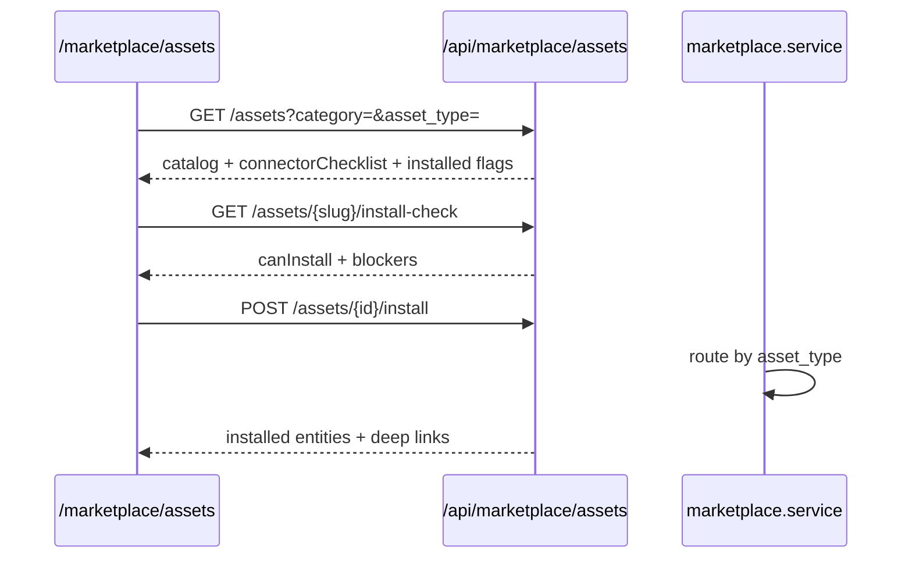
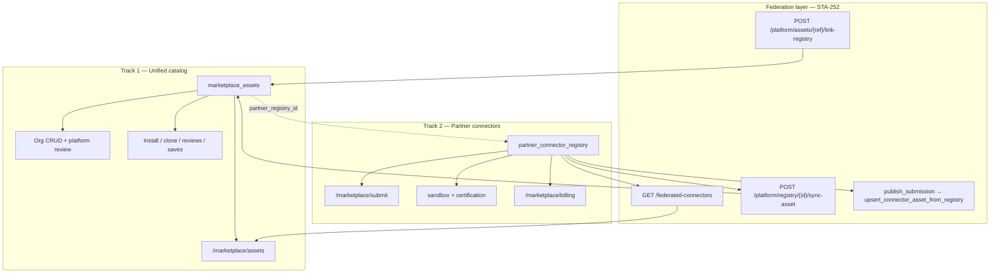

# Gravitre Marketplace — unified assets + department packs

Stage 1 ships a **unified asset registry** (`marketplace_assets`) for agents, workflows, knowledge packs, department packs, and connector configs. Legacy **role-packs** routes remain for backward compatibility; new UI and integrations should use **`/api/marketplace/assets`**.

## Unified asset types

| `asset_type` | Installs into |
|--------------|---------------|
| `ai_agent` | `operators` (+ `agents` mirror) |
| `workflow` | `workflow_defs` / active version |
| `knowledge_pack` | `rag_sources` |
| `department_pack` | agents + RAG + workflow (embedded pack config) |
| `connector_config` | connector readiness checklist only |

Gravitre starter catalog: **51 published assets** (seed CLI below; expanded in STA-229).

## Flow (unified)



## API — unified assets (preferred)

| Method | Path | Description |
|--------|------|-------------|
| GET | `/api/marketplace/assets` | Browse published catalog (filters: `category`, `department`, `asset_type`, `pricing_type`, `search`) |
| GET | `/api/marketplace/assets/{ref}` | Detail by UUID or slug; includes pack items for department packs |
| GET | `/api/marketplace/assets/{id}/install-check` | Connector pre-check (`canInstall`, `blockers`, checklist) |
| POST | `/api/marketplace/assets/{id}/install` | Install asset into org (admin) |
| POST | `/api/marketplace/assets/{ref}/clone` | Clone to private draft in org |
| GET | `/api/marketplace/installs` | Org install history + deep links |
| GET/POST/DELETE | `/api/marketplace/assets/{ref}/reviews*` | Org-scoped reviews |
| GET/POST/DELETE | `/api/marketplace/assets/{ref}/save` | Saved assets |
| GET | `/api/marketplace/categories` | Facet counts |
| GET | `/api/marketplace/analytics/summary` | Install/save aggregates |
| GET | `/api/marketplace/assets/{ref}/versions` | Version history (org-owned assets, admin) |
| POST | `/api/marketplace/assets/{ref}/rollback` | Restore live config from `marketplace_asset_versions` (admin) |

Next.js proxies live under `apps/web/app/api/marketplace/**`. Client: `marketplaceApi` in `apps/web/lib/api.ts`.

### Checklist fields

Each required connector returns:

- `connectorType`, `label`, `required`, `connected`, `connectPath`, `ready`, `action_url`

Browse/install responses also include `connectorsReady`, `requiredConnectorsConnected`, and `requiredConnectorsTotal`.

## Legacy role-packs (STA-121)

Still available; UI redirects `/marketplace/role-packs` → `/marketplace/assets`.

| Method | Path | Description |
|--------|------|-------------|
| GET | `/api/marketplace/role-packs` | Legacy department pack list |
| GET | `/api/marketplace/role-packs/{packId}` | Legacy pack detail |
| POST | `/api/marketplace/role-packs/{packId}/install` | Legacy install (`org_department_pack_installs`) |

Legacy pack IDs map to unified slugs (e.g. `support-ops` → `customer-success-pack`).

## What gets installed (department pack)

1. **Agents** — department-scoped operators with tool permissions for listed systems
2. **RAG sources** — manual sources (`pending_upload`) with upload instructions in metadata
3. **Workflow** — active version with connector steps when OAuth is connected; agent-only fallback otherwise
4. **Install record** — `marketplace_installs` (supersedes `org_department_pack_installs`; optional backfill)

Install is idempotent — re-running updates agents, sources, workflow versions, and the install ledger row.

## Seed runbook (MKT-4)

Run after migration `20260617130000_marketplace_unified_assets_schema.sql` is applied.

```powershell
cd backend

# Validate catalog only (no DB writes)
python scripts/seed_marketplace.py --dry-run

# Upsert Gravitre publisher + starter assets (51 in catalog)
python scripts/seed_marketplace.py

# Optional: backfill legacy org_department_pack_installs → marketplace_installs
python scripts/seed_marketplace.py --backfill-legacy
```

Requires `backend/.env` with `SUPABASE_URL` and `SUPABASE_SERVICE_ROLE_KEY`. Safe to re-run (upsert).

### Smoke verify (after seed)

```powershell
cd backend
python scripts/smoke_marketplace_install.py --ensure-hubspot --org-id <org-uuid>
```

Confirms connector pre-check, department pack install, and operator/agent/workflow creation. Use an org with agent plan headroom.

### CI regression guard (MKT-AUDIT-QA-1)

GitHub Actions **Backend (pytest)** job runs `python -m pytest tests/marketplace/ -q` on every PR (169+ tests covering browse, install, CRUD, publish, reviews, saves, plan limits).

Integration smoke (`scripts/test-integration.sh`) verifies marketplace routes respond on the local CI backend (401 without auth).

Production smoke (optional, requires `backend/.env.operator.local`):

```powershell
npm run smoke:marketplace-production
npm run marketplace:ensure-smoke-paid-asset
npm run smoke:marketplace-stripe
npm run smoke:marketplace-stripe:fulfill
```

Hits live Railway browse, M4 routes (`/analytics/roi`, `/federated-connectors`, `/assets/{ref}/entitlement`, `/install-check`), and optionally creates a real Stripe Checkout session for `smoke-paid-operator-pack`. Use `--simulate-fulfillment` to validate entitlement + payout backend after session creation (no browser payment).

## RLS (MKT-2.3 / MKT-13.1)

| Table | Policy |
|-------|--------|
| `marketplace_assets` | **Cross-tenant read** for `published` + `public`; org-owned and publisher-org rows for members |
| `marketplace_installs`, `reviews`, `saves` | **Org isolation** via `organization_members` |
| `marketplace_payouts` | Publisher org **admin SELECT only** (writes via service role) |

Backend routes use the **service role** and enforce org context in application code (browse list narrows to `published` + `public` or caller `org_id`). Contract tests: `backend/tests/marketplace/test_marketplace_rls.py`.

## Audit events

- `marketplace.asset.installed`
- `marketplace.asset.cloned`
- `marketplace.asset.rolled_back`
- `marketplace.role_pack.installed` (legacy path)

## Secret safety (MKT-9.5)

Asset payloads reject credential-like keys anywhere in `config`, `install_variables`, or `required_connectors` (e.g. `api_key`, `client_secret`, `*_token`). Validation runs on seed, publish, and version rollback. Tests: `test_marketplace_schemas.py`.

## Version rollback (MKT-9.4)

Org-owned assets keep snapshots in `marketplace_asset_versions`. Admins can list versions and roll back live config:

```http
GET  /api/marketplace/assets/{ref}/versions
POST /api/marketplace/assets/{ref}/rollback
     { "version": 2 }
```

Rollback restores `config`, connector requirements, and install variables from the selected snapshot and sets `current_version` to that version number. Gravitre catalog assets (`org_id` null) are not rollbackable via this API. Tests: `test_marketplace_versions.py`.

## Dual marketplace architecture (MKT-AUDIT-ARCH-1 / STA-227)

Gravitre runs **two parallel marketplace tracks**. They share org context and Stripe Connect billing, but differ in data model, lifecycle, and which product features apply.

### Decision (June 2026)

| Option | Outcome |
|--------|---------|
| **Full merge** — partner connectors become first-class unified assets with the same CRUD/review/install flows | **Rejected for Stage 1–4.** Partner submission, sandbox certification, and registry billing are materially different from agent/workflow/pack publishing. |
| **Federated browse + optional materialization** — partner registry stays canonical; unified catalog **projects** connectors at browse time and can **link** rows via `partner_registry_id` | **Chosen.** Implemented in STA-252 (M4). |

**Summary:** Track 1 (`marketplace_assets`) remains the canonical surface for agents, workflows, knowledge packs, and department packs. Track 2 (`partner_connector_registry`) remains canonical for partner connector submissions, sandbox scans, certification, and usage billing. Stage 4 **federates** track 2 into unified browse (and optional `connector_config` rows) without merging submission or billing flows.

### Architecture



### How federation works

1. **Browse-time projection** — `list_federated_connector_assets()` reads published registry rows, enriches pricing, and returns unified-shaped cards (`assetType: connector_config`, `source: partner_registry`, `federated: true`). The unified assets page merges these when the Connectors facet is active; `/marketplace/connectors` lists them directly.
2. **Optional materialization** — On registry publish, `upsert_connector_asset_from_registry()` creates or updates a `connector_config` row linked by `partner_registry_id`. Platform admins can also call `POST /api/marketplace/platform/registry/{registry_id}/sync-asset` or link an existing asset via `link-registry`.
3. **Non-blocking sync** — Registry publish succeeds even if unified asset upsert fails (logged; retried via platform sync).

### Scope matrix

| Capability | Unified assets (track 1) | Partner connectors (track 2) | Federated `connector_config` |
|------------|--------------------------|------------------------------|------------------------------|
| Browse in `/marketplace/assets` | Yes | Via federation merge | Yes (read-only card) |
| Org draft → review → publish | Yes | No (submission flow) | Materialized from registry only |
| Install into org (agents/workflows/RAG) | Yes | No | No (`canInstall: false`) |
| Reviews / saves / clone | Yes | No | No |
| Paid checkout + entitlements | Yes (STA-250) | Usage billing (partner pricing) | Pricing shown; install N/A |
| Publisher payout sync | Asset sales (STA-251/257) | Connector usage (billing page) | N/A |
| Platform featured / verified flags | Yes (STA-249) | Certification badge on registry | Inherits badge when linked |

**Out of scope for federated connectors (by design):** unified-asset install, clone, org-internal publish workflow, Gravitre public review queue, and paid asset checkout — partners continue via submit → sandbox → registry → billing.

### API routes (federation)

| Method | Path | Role |
|--------|------|------|
| GET | `/api/marketplace/federated-connectors` | Org member — federated browse |
| POST | `/api/marketplace/platform/registry/{registry_id}/sync-asset` | Platform admin — materialize/update asset |
| POST | `/api/marketplace/platform/assets/{asset_ref}/link-registry` | Platform admin — attach `partner_registry_id` |

Implementation: `backend/app/marketplace/convergence.py`. Tests: `test_marketplace_convergence.py`, `test_marketplace_convergence_routes.py`.

### Follow-up (closed)

| Linear | Title | Status |
|--------|-------|--------|
| STA-252 | Converge partner registry with `connector_config` assets | Done — federation + upsert on publish |
| STA-255–257 | Publisher analytics, pricing UI, payout sync | Done — applies to track 1 asset sales; track 2 billing unchanged |

### Future convergence (not planned)

A later **full merge** (single CRUD path for all asset types including connectors) would require migrating partner submissions into unified publish, retiring `partner_connector_registry` as canonical, and re-homing usage billing onto asset entitlements. No Linear issue is open for this; revisit only if product requires one submission UX for all marketplace content.

## Analytics counters (MKT-10.1)

`install_count` and `clone_count` on `marketplace_assets` increment atomically via Postgres RPC `increment_marketplace_asset_counter` (migration `20260617140000_marketplace_atomic_counters.sql`). `GET /api/marketplace/analytics/summary` aggregates these fields for catalog totals. Tests: `test_marketplace_counters.py`.

## Related

- Partner marketplace sandbox — STA-73 (`marketplace_sandbox_service.py`)
- v0 UI handoff — [`V0_MARKETPLACE_UNIFIED_PROMPT.md`](../design/V0_MARKETPLACE_UNIFIED_PROMPT.md)
- Backend sync table — [`V0_BACKEND_SYNC.md`](V0_BACKEND_SYNC.md)

## Key files

| Area | Path |
|------|------|
| Schema + RLS | `supabase/migrations/20260617130000_marketplace_unified_assets_schema.sql` |
| Seed catalog | `backend/app/marketplace/seed_catalog.py`, `seed_service.py` |
| Seed CLI | `backend/scripts/seed_marketplace.py` |
| Install / clone | `backend/app/marketplace/service.py`, `clone.py` |
| Versions / rollback | `backend/app/marketplace/versions.py` |
| Atomic counters | `backend/app/marketplace/counters.py`, `supabase/migrations/20260617140000_marketplace_atomic_counters.sql` |
| Browse / support | `backend/app/marketplace/browse.py`, `support.py` |
| Federation / convergence | `backend/app/marketplace/convergence.py` |
| Federated UI | `apps/web/app/marketplace/connectors/page.tsx`, federated merge in `assets/page.tsx` |
| Unified UI | `apps/web/app/marketplace/assets/page.tsx`, `assets/[slug]/page.tsx`, `analytics/page.tsx` |
| API router | `backend/app/routers/marketplace.py` |
| Legacy catalog | `backend/app/services/department_pack_catalog.py`, `agent_role_marketplace_service.py` |
| Legacy migration | `supabase/migrations/20260608230000_department_pack_installs.sql` |
| Tests | `backend/tests/marketplace/` |
