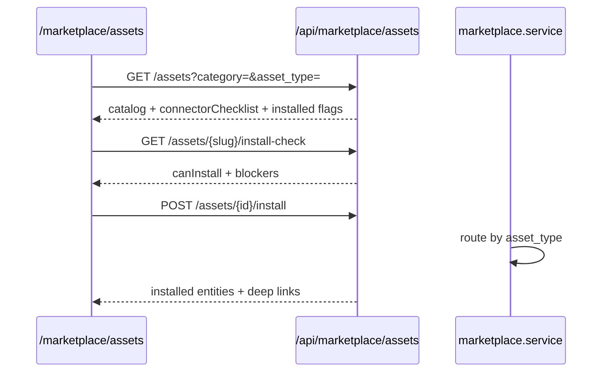

# Gravitre Marketplace — unified assets + department packs

Stage 1 ships a **unified asset registry** (`marketplace_assets`) for agents, workflows, knowledge packs, department packs, and connector configs. Legacy **role-packs** routes remain for backward compatibility; new UI and integrations should use **`/api/marketplace/assets`**.

## Unified asset types

| `asset_type` | Installs into |
|--------------|---------------|
| `ai_agent` | `operators` (+ `agents` mirror) |
| `workflow` | `workflow_defs` / active version |
| `knowledge_pack` | `rag_sources` |
| `department_pack` | agents + RAG + workflow (embedded pack config) |
| `connector_config` | connector readiness checklist only |

Gravitre starter catalog: **27 published assets** (seed CLI below).

## Flow (unified)



## API — unified assets (preferred)

| Method | Path | Description |
|--------|------|-------------|
| GET | `/api/marketplace/assets` | Browse published catalog (filters: `category`, `department`, `asset_type`, `pricing_type`, `search`) |
| GET | `/api/marketplace/assets/{ref}` | Detail by UUID or slug; includes pack items for department packs |
| GET | `/api/marketplace/assets/{id}/install-check` | Connector pre-check (`canInstall`, `blockers`, checklist) |
| POST | `/api/marketplace/assets/{id}/install` | Install asset into org (admin) |
| POST | `/api/marketplace/assets/{ref}/clone` | Clone to private draft in org |
| GET | `/api/marketplace/installs` | Org install history + deep links |
| GET/POST/DELETE | `/api/marketplace/assets/{ref}/reviews*` | Org-scoped reviews |
| GET/POST/DELETE | `/api/marketplace/assets/{ref}/save` | Saved assets |
| GET | `/api/marketplace/categories` | Facet counts |
| GET | `/api/marketplace/analytics/summary` | Install/save aggregates |
| GET | `/api/marketplace/assets/{ref}/versions` | Version history (org-owned assets, admin) |
| POST | `/api/marketplace/assets/{ref}/rollback` | Restore live config from `marketplace_asset_versions` (admin) |

Next.js proxies live under `apps/web/app/api/marketplace/**`. Client: `marketplaceApi` in `apps/web/lib/api.ts`.

### Checklist fields

Each required connector returns:

- `connectorType`, `label`, `required`, `connected`, `connectPath`, `ready`, `action_url`

Browse/install responses also include `connectorsReady`, `requiredConnectorsConnected`, and `requiredConnectorsTotal`.

## Legacy role-packs (STA-121)

Still available; UI redirects `/marketplace/role-packs` → `/marketplace/assets`.

| Method | Path | Description |
|--------|------|-------------|
| GET | `/api/marketplace/role-packs` | Legacy department pack list |
| GET | `/api/marketplace/role-packs/{packId}` | Legacy pack detail |
| POST | `/api/marketplace/role-packs/{packId}/install` | Legacy install (`org_department_pack_installs`) |

Legacy pack IDs map to unified slugs (e.g. `support-ops` → `customer-success-pack`).

## What gets installed (department pack)

1. **Agents** — department-scoped operators with tool permissions for listed systems
2. **RAG sources** — manual sources (`pending_upload`) with upload instructions in metadata
3. **Workflow** — active version with connector steps when OAuth is connected; agent-only fallback otherwise
4. **Install record** — `marketplace_installs` (supersedes `org_department_pack_installs`; optional backfill)

Install is idempotent — re-running updates agents, sources, workflow versions, and the install ledger row.

## Seed runbook (MKT-4)

Run after migration `20260617130000_marketplace_unified_assets_schema.sql` is applied.

```powershell
cd backend

# Validate catalog only (no DB writes)
python scripts/seed_marketplace.py --dry-run

# Upsert Gravitre publisher + 27 starter assets
python scripts/seed_marketplace.py

# Optional: backfill legacy org_department_pack_installs → marketplace_installs
python scripts/seed_marketplace.py --backfill-legacy
```

Requires `backend/.env` with `SUPABASE_URL` and `SUPABASE_SERVICE_ROLE_KEY`. Safe to re-run (upsert).

### Smoke verify (after seed)

```powershell
cd backend
python scripts/smoke_marketplace_install.py --ensure-hubspot --org-id <org-uuid>
```

Confirms connector pre-check, department pack install, and operator/agent/workflow creation. Use an org with agent plan headroom.

## RLS (MKT-2.3 / MKT-13.1)

| Table | Policy |
|-------|--------|
| `marketplace_assets` | **Cross-tenant read** for `published` + `public`; org-owned and publisher-org rows for members |
| `marketplace_installs`, `reviews`, `saves` | **Org isolation** via `organization_members` |
| `marketplace_payouts` | Publisher org **admin SELECT only** (writes via service role) |

Backend routes use the **service role** and enforce org context in application code (browse list narrows to `published` + `public` or caller `org_id`). Contract tests: `backend/tests/marketplace/test_marketplace_rls.py`.

## Audit events

- `marketplace.asset.installed`
- `marketplace.asset.cloned`
- `marketplace.asset.rolled_back`
- `marketplace.role_pack.installed` (legacy path)

## Secret safety (MKT-9.5)

Asset payloads reject credential-like keys anywhere in `config`, `install_variables`, or `required_connectors` (e.g. `api_key`, `client_secret`, `*_token`). Validation runs on seed, publish, and version rollback. Tests: `test_marketplace_schemas.py`.

## Version rollback (MKT-9.4)

Org-owned assets keep snapshots in `marketplace_asset_versions`. Admins can list versions and roll back live config:

```http
GET  /api/marketplace/assets/{ref}/versions
POST /api/marketplace/assets/{ref}/rollback
     { "version": 2 }
```

Rollback restores `config`, connector requirements, and install variables from the selected snapshot and sets `current_version` to that version number. Gravitre catalog assets (`org_id` null) are not rollbackable via this API. Tests: `test_marketplace_versions.py`.

## Analytics counters (MKT-10.1)

`install_count` and `clone_count` on `marketplace_assets` increment atomically via Postgres RPC `increment_marketplace_asset_counter` (migration `20260617140000_marketplace_atomic_counters.sql`). `GET /api/marketplace/analytics/summary` aggregates these fields for catalog totals. Tests: `test_marketplace_counters.py`.

## Related

- Partner marketplace sandbox — STA-73 (`marketplace_sandbox_service.py`)
- v0 UI handoff — [`V0_MARKETPLACE_UNIFIED_PROMPT.md`](../design/V0_MARKETPLACE_UNIFIED_PROMPT.md)
- Backend sync table — [`V0_BACKEND_SYNC.md`](V0_BACKEND_SYNC.md)

## Key files

| Area | Path |
|------|------|
| Schema + RLS | `supabase/migrations/20260617130000_marketplace_unified_assets_schema.sql` |
| Seed catalog | `backend/app/marketplace/seed_catalog.py`, `seed_service.py` |
| Seed CLI | `backend/scripts/seed_marketplace.py` |
| Install / clone | `backend/app/marketplace/service.py`, `clone.py` |
| Versions / rollback | `backend/app/marketplace/versions.py` |
| Atomic counters | `backend/app/marketplace/counters.py`, `supabase/migrations/20260617140000_marketplace_atomic_counters.sql` |
| Browse / support | `backend/app/marketplace/browse.py`, `support.py` |
| Unified UI | `apps/web/app/marketplace/assets/page.tsx` (drawer, install stepper, motion) |
| API router | `backend/app/routers/marketplace.py` |
| Legacy catalog | `backend/app/services/department_pack_catalog.py`, `agent_role_marketplace_service.py` |
| Legacy migration | `supabase/migrations/20260608230000_department_pack_installs.sql` |
| Tests | `backend/tests/marketplace/` |
