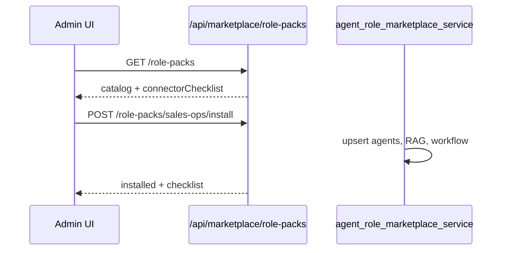

# Agent role marketplace — department packs (STA-121)

One-click install of department role packs: **agents**, **RAG sources**, **workflows**, and a **connector requirements checklist**. Builds on the partner marketplace (STA-73) catalog pattern.

## Available packs

| Pack ID | Department | Connectors |
|---------|------------|------------|
| `sales-ops` | Sales | HubSpot (required) |
| `marketing-ops` | Marketing | HubSpot (required), Slack (optional) |
| `support-ops` | Support | Zendesk (required) |
| `finance-ops` | Finance | QuickBooks (required) |

Install is idempotent — re-running updates agents, sources, and workflow versions.

## Flow

## API

| Method | Path | Description |
|--------|------|-------------|
| GET | `/api/marketplace/role-packs` | List packs with install status + connector checklist |
| GET | `/api/marketplace/role-packs/{packId}` | Pack detail |
| POST | `/api/marketplace/role-packs/{packId}/install` | One-click install (admin) |

### Checklist fields

Each required connector returns:

- `connectorType`, `label`, `required`, `connected`, `connectPath`, `ready`

Pack summary includes `connectorsReady`, `requiredConnectorsConnected`, and `requiredConnectorsTotal`.

## What gets installed

1. **Agents** — department-scoped operators with tool permissions for listed systems
2. **RAG sources** — manual sources (`pending_upload`) with upload instructions in metadata
3. **Workflow** — active version with connector steps when OAuth is connected; agent-only fallback otherwise
4. **Install record** — `org_department_pack_installs` tracks IDs and checklist snapshot

## Audit

- `marketplace.role_pack.installed`

## Related

- Partner marketplace sandbox — STA-73 (`marketplace_sandbox_service.py`)
- Vertical packs — legal/healthcare/real estate (`/api/verticals/*`)

## Key files

- Catalog: `backend/app/services/department_pack_catalog.py`
- Service: `backend/app/services/agent_role_marketplace_service.py`
- API: `backend/app/routers/marketplace.py`
- Migration: `supabase/migrations/20260608230000_department_pack_installs.sql`
