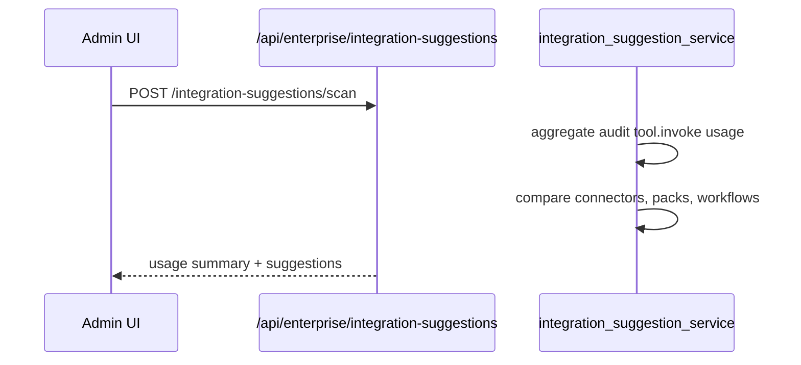

# Auto-suggest connectors & workflows from audit data (STA-123)

Audit-driven recommendations like: *"You run 40% of HubSpot tasks manually — install the Sales Operations Pack to automate workflows."*

## How it works

1. Scan `audit_events` for `tool.invoke.*` over a lookback window (default 30 days).
2. Classify invocations as **manual** (no `run_id` in metadata) vs **workflow** (has `run_id`).
3. Aggregate by connector type and action.
4. Emit suggestions when thresholds are met.

## Suggestion types

| Type | When | Example |
|------|------|---------|
| `connect_connector` | Tool usage exists but no active connector | Connect HubSpot to enable STA-15 actions |
| `install_department_pack` | ≥40% manual usage, connector connected, pack not installed | Install Sales Operations Pack |
| `automate_workflow` | ≥40% manual usage, packs already installed | Create workflow for top manual actions |

Minimum **5** tool events per connector type before suggesting.

## Flow

## API

| Method | Path | Description |
|--------|------|-------------|
| GET | `/api/enterprise/integration-suggestions` | List suggestions (`status`, `connectorType`) |
| POST | `/api/enterprise/integration-suggestions/scan?lookbackDays=30` | Scan audit data and persist open suggestions |
| POST | `/api/enterprise/integration-suggestions/{id}/dismiss` | Dismiss a suggestion |

### Scan response

- `lookbackDays`, `usage` (connector stats + top actions), `suggestionCount`, `suggestions[]`, `scannedAt`

Each suggestion includes `suggestionType`, `title`, `message`, `evidence`, `confidence`, `priority`, optional `packId` and `connectorType`.

## Storage

Table: `integration_suggestions` (migration `20260609100000_integration_suggestions.sql`).

Open suggestions are replaced on each scan; dismissed suggestions are kept.

## Audit

- `integration.suggestions.scanned`

## Related

- Workforce analytics — `GET /api/enterprise/workforce-analytics` (STA-91)
- Department packs — `GET /api/marketplace/role-packs` (STA-121)
- Predictive failure alerts — `docs/integration/predictive-workflow-failure.md` (STA-122)

## Linear

- [STA-123](https://linear.app/staqbot/issue/STA-123) — T5-018 Auto-suggest connectors & workflows from audit data
