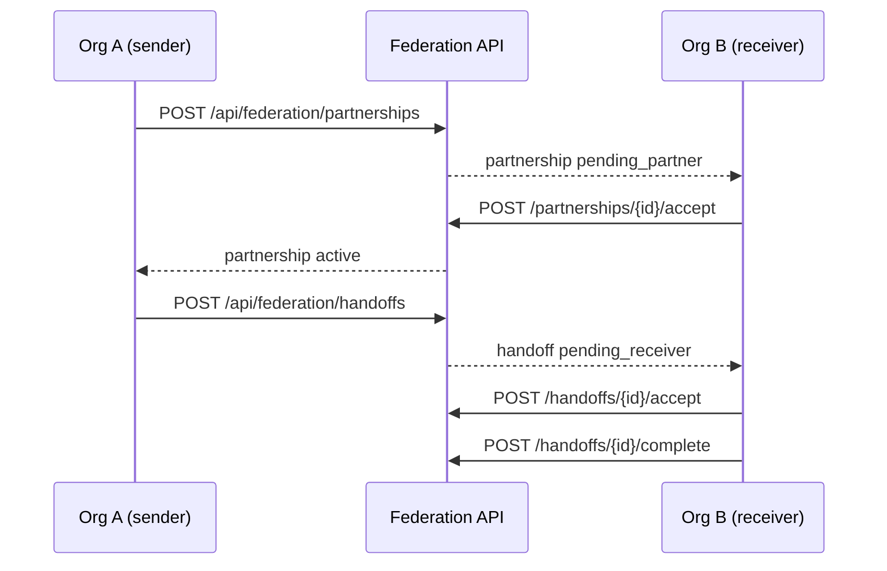

# B2B cross-org agent handoff protocol (STA-116)

Org A can exchange structured agent briefings with Org B when both organizations have mutually consented to a B2B partnership and the receiver accepts each handoff.

## Flow

## Partnership consent

| Method | Path | Description |
|--------|------|-------------|
| GET | `/api/federation/partnerships` | List partnerships for current org |
| POST | `/api/federation/partnerships` | Invite partner org (admin) |
| POST | `/api/federation/partnerships/{id}/accept` | Partner org accepts (admin) |
| POST | `/api/federation/partnerships/{id}/reject` | Partner org rejects invite |
| POST | `/api/federation/partnerships/{id}/revoke` | Either org revokes active/pending link |

## Handoff exchange

Briefings reuse the STA-17 shape: `{ contact?, deal?, decision?, artifacts[] }` via `build_handoff_briefing`.

| Method | Path | Description |
|--------|------|-------------|
| GET | `/api/federation/handoffs` | List inbound/outbound handoffs |
| GET | `/api/federation/handoffs/{id}` | Fetch one handoff |
| POST | `/api/federation/handoffs` | Send briefing to partner org (admin) |
| POST | `/api/federation/handoffs/{id}/accept` | Receiver accepts briefing |
| POST | `/api/federation/handoffs/{id}/reject` | Receiver rejects briefing |
| POST | `/api/federation/handoffs/{id}/complete` | Mark accepted handoff complete |

## Audit events

- `federation.partnership.invited` / `.accepted` / `.rejected` / `.revoked`
- `federation.handoff.sent` / `.accepted` / `.rejected` / `.completed`

## Related

- STA-17 intra-org handoff bus — `backend/app/services/handoff_service.py`
- STA-117 federated connector consent — `docs/integration/federated-connector-consent.md`
- STA-118 delegate task to external org — builds on accepted handoffs

## Key files

- Migration: `supabase/migrations/20260608180000_b2b_federation_handoffs.sql`
- Service: `backend/app/services/b2b_handoff_service.py`
- API: `backend/app/routers/federation.py`
