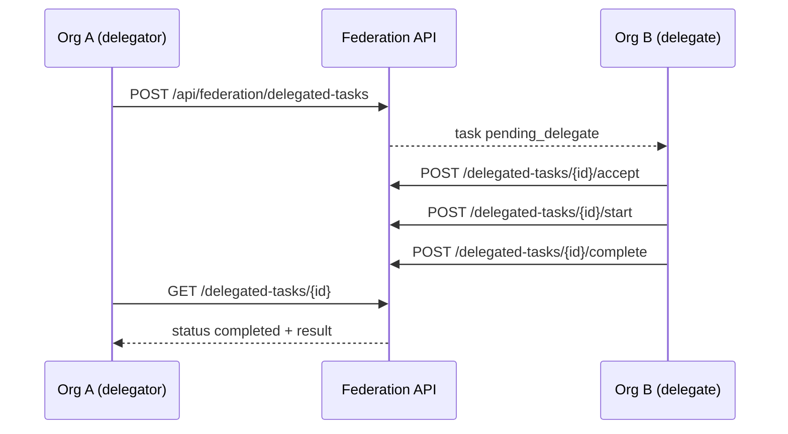

# Cross-org delegated tasks (STA-118)

Prime contractor (delegator org) assigns a sub-task to subcontractor (delegate org). The delegate accepts, executes, and reports completion; status and results sync back to the delegator via `syncVersion` / `statusSyncedAt`.

## Flow



Requires an **active B2B partnership** (STA-116). Optional federated connector grants (STA-117) let the delegate org invoke read-only tools on the delegator's connectors while executing the task.

## Status lifecycle

| Status | Meaning |
|--------|---------|
| `pending_delegate` | Delegator created task; waiting for delegate acceptance |
| `accepted` | Delegate accepted assignment |
| `in_progress` | Delegate started work |
| `completed` | Delegate finished; `result` synced to delegator |
| `rejected` | Delegate declined pending task |
| `cancelled` | Delegator cancelled before work started |
| `failed` | Delegate marked task failed after acceptance |

Poll `GET /api/federation/delegated-tasks/{id}` and compare `syncVersion` or `statusSyncedAt` for status sync.

## API

| Method | Path | Description |
|--------|------|-------------|
| GET | `/api/federation/delegated-tasks` | List tasks (`direction=all\|inbound\|outbound`, optional `status`) |
| GET | `/api/federation/delegated-tasks/{id}` | Fetch one task (either org) |
| POST | `/api/federation/delegated-tasks` | Delegate task to partner org (admin) |
| POST | `/api/federation/delegated-tasks/{id}/accept` | Delegate accepts (optional `spawnAgentJob`) |
| POST | `/api/federation/delegated-tasks/{id}/reject` | Delegate rejects pending task |
| POST | `/api/federation/delegated-tasks/{id}/start` | Delegate marks in progress |
| POST | `/api/federation/delegated-tasks/{id}/complete` | Delegate completes with `result` payload |
| POST | `/api/federation/delegated-tasks/{id}/fail` | Delegate marks failed |
| POST | `/api/federation/delegated-tasks/{id}/cancel` | Delegator cancels pending/accepted task |

### Create body

```json
{
  "delegateOrgId": "uuid",
  "title": "Review subcontractor bid",
  "instructions": "Validate pricing sheet against RFP",
  "payload": { "bidId": "bid-99" },
  "parentReference": { "type": "workflow_run", "id": "run-1" },
  "delegatorAgentId": null,
  "delegateAgentId": null
}
```

## Audit events

- `federation.task.delegated` / `.accepted` / `.started` / `.completed` / `.rejected` / `.cancelled` / `.failed`

## Related

- STA-116 B2B handoffs — `docs/integration/b2b-handoff-protocol.md`
- STA-117 federated connector consent — `docs/integration/federated-connector-consent.md`

## Key files

- Migration: `supabase/migrations/20260608200000_cross_org_delegated_tasks.sql`
- Service: `backend/app/services/cross_org_delegated_task_service.py`
- API: `backend/app/routers/federation.py`
