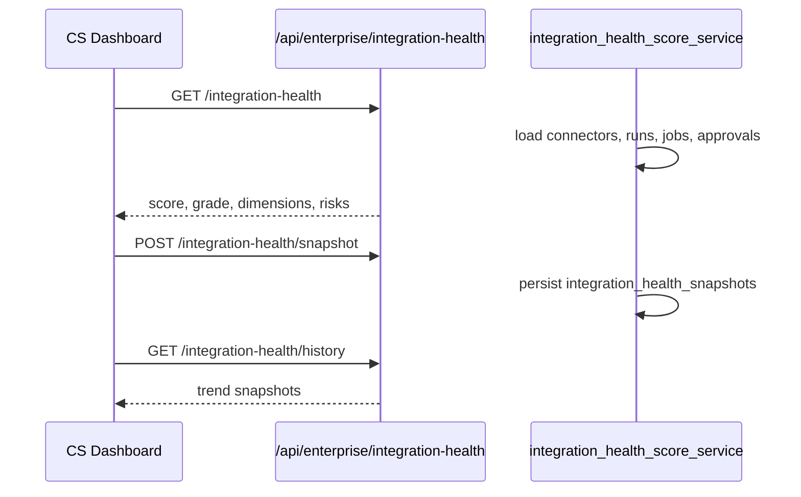

# Customer integration health score — CS dashboard (STA-124)

Composite **0–100 health score** for customer success teams, built from four weighted dimensions aligned with workforce analytics (STA-91).

## Dimensions (25% each)

| Dimension | Source | What it measures |
|-----------|--------|------------------|
| `connectorsLive` | `connectors` | Active vs total connectors; penalizes unhealthy auth |
| `workflowSuccessRate` | `workflow_runs` (execute) | Completed / (completed + failed) in lookback window |
| `agentUtilization` | `agent_jobs` | Task completion rate; penalizes timeouts |
| `approvalLatency` | `run_approvals` + runs | p95 minutes from run creation to first approval |

## Grades

| Score | Grade | CS interpretation |
|-------|-------|-------------------|
| 85–100 | `healthy` | Integration operating well |
| 65–84 | `at_risk` | Needs attention on one or more dimensions |
| 0–64 | `critical` | Escalate — connectors, workflows, or approvals degraded |

## Flow

## API

| Method | Path | Description |
|--------|------|-------------|
| GET | `/api/enterprise/integration-health?lookbackDays=30` | Live composite score + dimension breakdown |
| POST | `/api/enterprise/integration-health/snapshot?lookbackDays=30` | Record snapshot for trend charts |
| GET | `/api/enterprise/integration-health/history?limit=30` | List historical snapshots |

### Response fields

- `score`, `grade`, `dimensions`, `risks[]`, `weights`, `lookbackDays`, `computedAt`
- Each dimension includes `score`, `summary`, and metric-specific counts/rates

## Storage

Table: `integration_health_snapshots` (migration `20260609120000_integration_health_snapshots.sql`).

## Audit

- `integration.health.snapshot`

## Related

- Workforce analytics — `GET /api/enterprise/workforce-analytics` (STA-91)
- Integration suggestions — `docs/integration/auto-suggest-connectors-workflows.md` (STA-123)
- Failure predictions — `docs/integration/predictive-workflow-failure.md` (STA-122)

## Linear

- [STA-124](https://linear.app/staqbot/issue/STA-124) — T5-019 Customer integration health score (CS dashboard)
