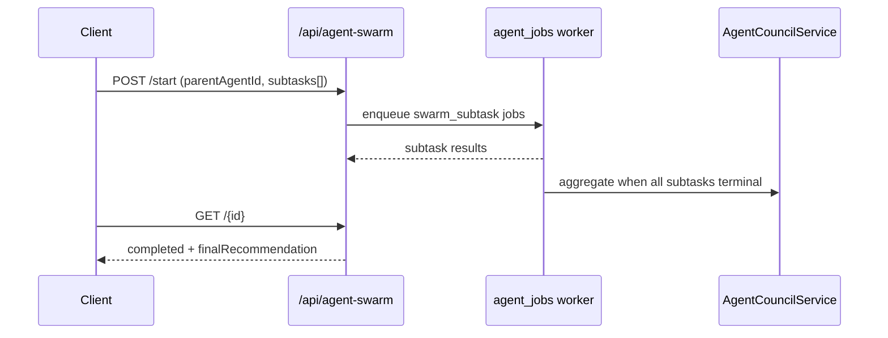

# Multi-agent swarm coordinator (STA-119)

Parent agent spawns N scoped sub-agents through the durable `agent_jobs` queue. When all subtasks finish, the council service aggregates their findings into a single recommendation.

## Flow



## API

| Method | Path | Description |
|--------|------|-------------|
| GET | `/api/agent-swarm` | List recent swarm runs |
| GET | `/api/agent-swarm/{id}` | Fetch run with subtasks |
| POST | `/api/agent-swarm/start` | Spawn sub-agents (max 10) |
| POST | `/api/agent-swarm/{id}/aggregate` | Manual council aggregation |
| POST | `/api/agent-swarm/{id}/cancel` | Cancel pending/running swarm |

### Start body

```json
{
  "parentAgentId": "uuid",
  "objective": "Select vendor for Q3 rollout",
  "decisionMethod": "majority_vote",
  "subtasks": [
    {
      "agentId": "uuid",
      "task": "Review pricing and SLA terms",
      "scopedTools": [{ "connectorType": "hubspot", "action": "search_contacts" }]
    }
  ]
}
```

Each subtask becomes an `agent_jobs` row with `kind=swarm_subtask`. Scoped tools are enforced at planning time and recorded on the subtask result for audit.

## Aggregation

When every subtask reaches a terminal status (`completed`, `failed`, or `cancelled`), the worker calls `aggregate_swarm_run`:

1. Build council **options** from each subtask's `recommendedAction` (or summary).
2. Run `AgentCouncilService.start_council` with subtask agents as voters.
3. Persist `finalRecommendation`, `finalConfidence`, and full `aggregateResult` on the swarm run.

## Audit events

- `swarm.started`
- `swarm.aggregated`
- `swarm.cancelled`

## Related

- Council debates — `backend/app/services/council_service.py` (STA-48)
- Agent job queue — `backend/app/operators/agent_jobs.py`

## Key files

- Migration: `supabase/migrations/20260608210000_agent_swarm_runs.sql`
- Service: `backend/app/services/swarm_coordinator_service.py`
- API: `backend/app/routers/agent_swarm.py`
