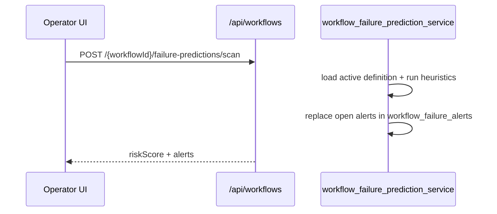

# Predictive workflow failure detection (STA-122)

Heuristic alerts **before** workflow steps fail: OAuth expiry, auth disconnect, rate-limit trends, missing agent scopes, elevated step failure rates, and missing connectors.

## Heuristics

| Alert type | Trigger | Severity |
|------------|---------|----------|
| `auth_disconnected` | Connector auth status is `pending_auth`, `auth_expired`, or `misconfigured` | critical |
| `auth_expiry` | OAuth token expires within 72h (24h → critical) | high / critical |
| `rate_limit_trend` | ≥2 rate-limit failures in last 3 days and count rising vs prior 4 days | high |
| `missing_scope` | Agent step lacks tool permissions for required action | high |
| `step_failure_risk` | Step failed in ≥25% of last 25 runs (≥5 attempts) | medium / high |
| `connector_missing` | Step requires connector type with no active connector | critical |

## Flow

Run a scan before execute or on a schedule. Open alerts are replaced on each scan; dismissed alerts are preserved.

## API

| Method | Path | Description |
|--------|------|-------------|
| GET | `/api/workflows/failure-predictions?workflowId=` | List alerts (default `status=open`) |
| POST | `/api/workflows/{workflowId}/failure-predictions/scan` | Scan workflow and persist alerts |
| POST | `/api/workflows/failure-predictions/{alertId}/dismiss` | Dismiss an alert |

### Scan response

- `workflowId`, `alertCount`, `riskScore` (0–100), `alerts[]`, `scannedAt`, `environment`

Each alert includes `alertType`, `severity`, `title`, `message`, `evidence`, `confidence`, `stepId`, `connectorId`.

## Storage

Table: `workflow_failure_alerts` (migration `20260609000000_workflow_failure_alerts.sql`).

## Audit

- `workflow.failure_prediction.scanned` — metadata includes `alertCount`, `riskScore`, `alertTypes`

## Related

- Post-run optimization — `optimization_service.py` (STA-94)
- Agent workforce analytics — `workforce_analytics_service.py` (STA-91)
- Connector auth health — `connection_health.py`

## Linear

- [STA-122](https://linear.app/staqbot/issue/STA-122) — T5-017 Predictive workflow failure detection
