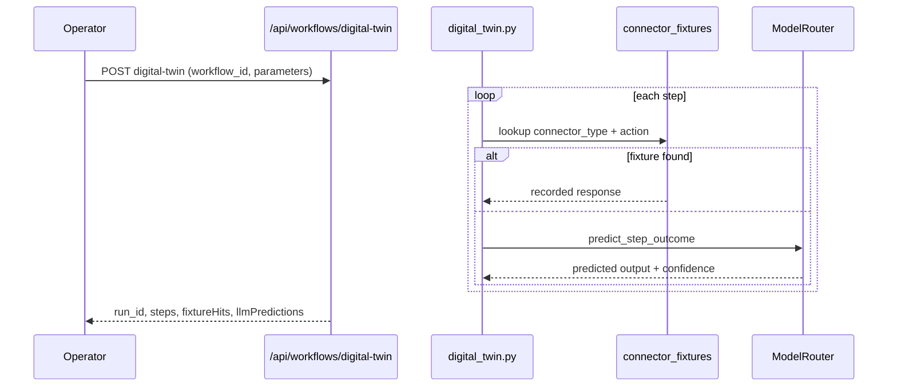

# Workflow digital twin (STA-120)

Simulate a workflow before live execution using **recorded connector fixtures** and **LLM outcome prediction**. No connector writes or external side effects (RAG retrieve remains a real read, same as classic dry-run).

## Flow



## API

| Method | Path | Description |
|--------|------|-------------|
| POST | `/api/workflows/digital-twin` | Simulate workflow (`run_type=digital_twin`) |
| GET | `/api/workflows/connector-fixtures` | List org fixtures |
| POST | `/api/workflows/connector-fixtures` | Upsert fixture (admin) |
| DELETE | `/api/workflows/connector-fixtures/{id}` | Delete fixture (admin) |

Request body matches dry-run: `{ workflowId?, definition?, parameters? }`.

Response adds:

- `simulationMode`: `digital_twin`
- `fixtureHits` — steps replayed from recorded fixtures
- `llmPredictions` — steps predicted by LLM
- `ragReads` — RAG steps that performed real retrieval

## Fixture format

```json
{
  "connectorType": "hubspot",
  "action": "hubspot.search_contacts",
  "label": "demo-search",
  "response": { "total": 2, "results": [] }
}
```

Fixtures are keyed by org + environment + connector type + action. Upsert replaces the latest matching label (or unlabeled) row.

## Step simulation rules

| Step type | Behavior |
|-----------|----------|
| `rag_retrieve` | Real read (no writes) |
| Connector / `invoke_tool` | Fixture replay if present, else LLM prediction |
| Agent / council / other | LLM prediction |

Each step output includes `source`: `fixture`, `llm_prediction`, or `live_read`.

## Related

- Classic dry-run — `backend/app/workflows/dry_run.py` (handler `simulate()` stubs)
- Execute path — `POST /api/workflows/execute` (live, approval-gated)

## Key files

- Migration: `supabase/migrations/20260608220000_workflow_digital_twin.sql`
- Engine: `backend/app/workflows/digital_twin.py`
- Fixtures: `backend/app/services/connector_fixture_service.py`
- Predictor: `backend/app/services/workflow_twin_predictor_service.py`
