# Gravitre 3.0 Plus — structural gate review (665b97ad)

VISUAL_ACCEPTANCE = NOT ACCEPTED. Not merged. Not deployed.

## Build identity

| Set | Source | Branch | SHA | Build ID | Viewport | Theme | Classification |
|---|---|---|---|---|---|---|---|
| BEFORE (01, 03, 05, 08, 11, 13) | https://gravitre.app (production `main`), captured 2026-09-26T06:28Z | `main` | production deploy | — | 1440×900 | light | E2E billing fixture test tenant, read-only; not owner-live |
| AFTER (02, 04, 06, 09, 12, 14) | local `next start` production build against production Supabase auth + api.gravitre.app, captured 2026-09-26T23:32Z | `feat/gravitre-3.0-plus-frontend` | `665b97ad964fc3184da32344ef0eecb30280544c` | `DFFQachDxFSignKgq9Gqp` | 1440×900 | light | Same E2E fixture test tenant, real API responses; not owner-live |
| AFTER FIXTURE (07, 10) | `next dev` `/e2e/shots/*` harness (fixture network layer), captured 2026-09-26T23:17Z | `feat/gravitre-3.0-plus-frontend` | working tree 22 min before `665b97ad` | dev (no build ID) | 1440×900 | light | FIXTURE data. 07 also uses a MOCKED `/api/chat` reply. Differs from `665b97ad` only in colour: brand link shade and avatar shade (a11y contrast fix); layout identical |

Derived images: 03/04 are 01/02 with `grayscale(1) contrast(1.15) blur(2.2px)`. 13/14 are the top 320px of 01/02.

## Dashboard

| Before | After |
|---|---|
| 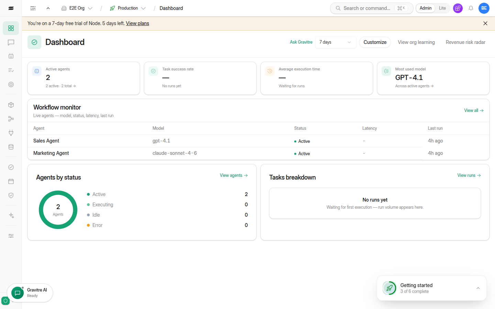 | 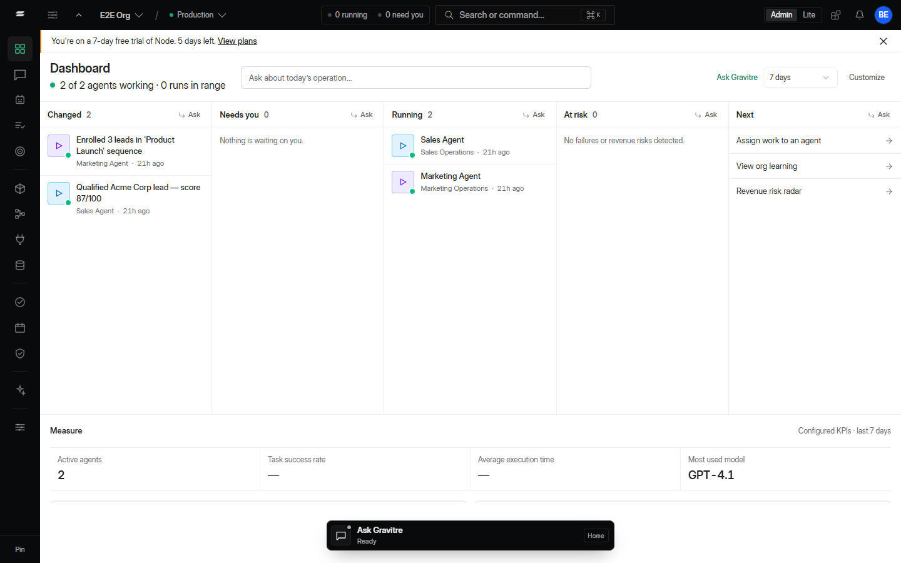 |
| 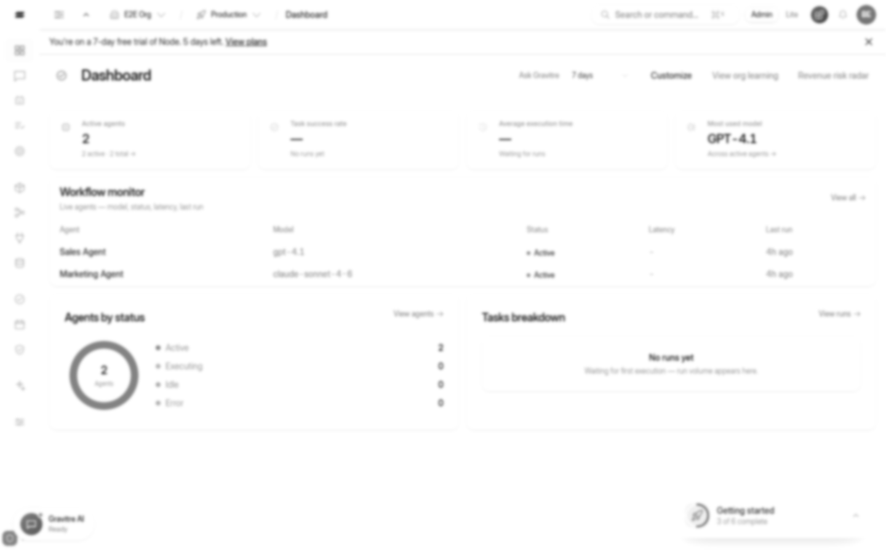 | 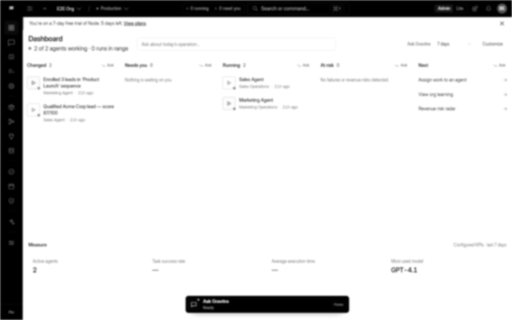 |

## AI workspace

| Before — start | After — start |
|---|---|
| 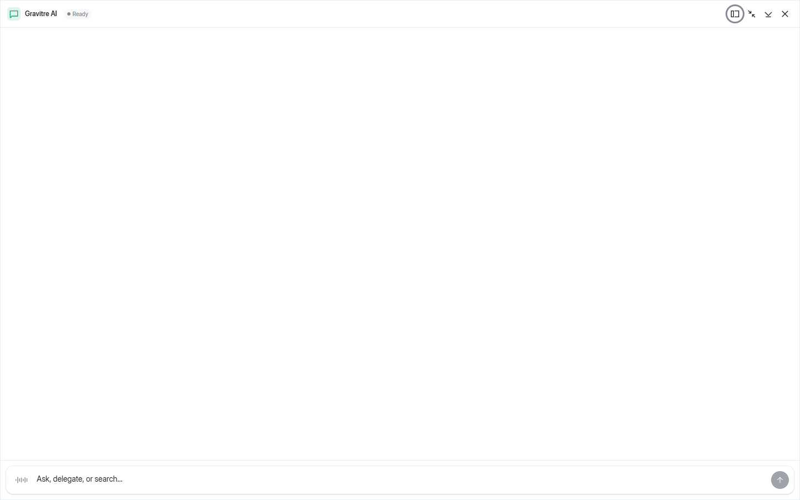 | 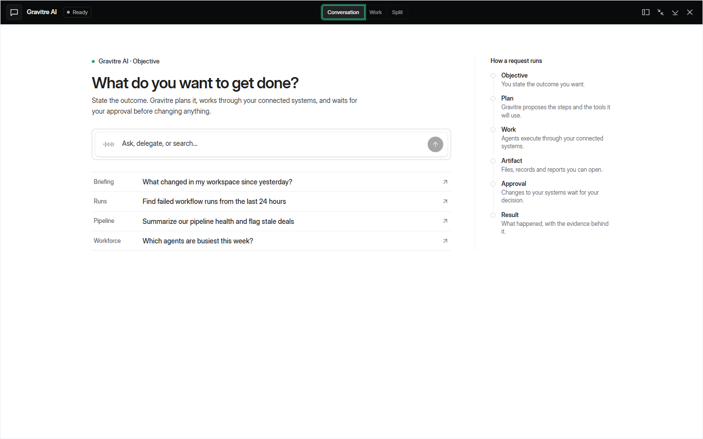 |

After — active request with mission rail (FIXTURE, MOCKED reply):

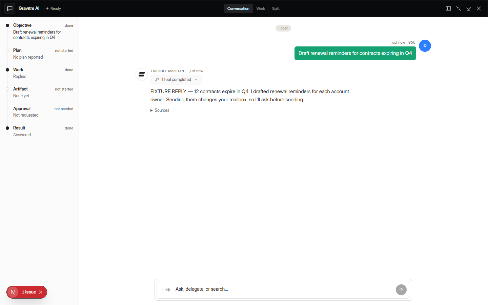

## Assignments

| Before | After |
|---|---|
| 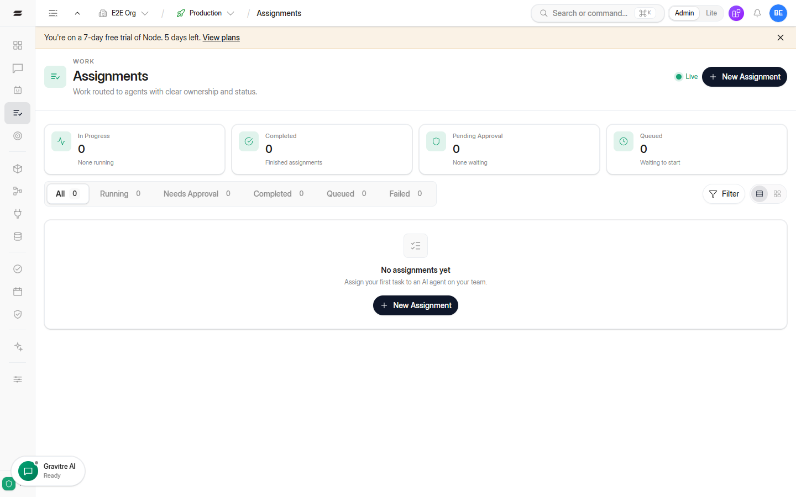 | 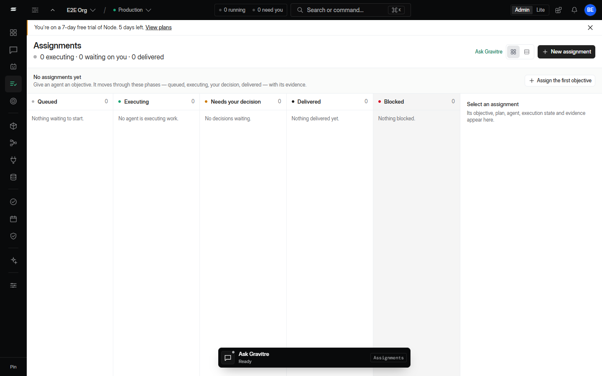 |

After — inspector open (FIXTURE data):

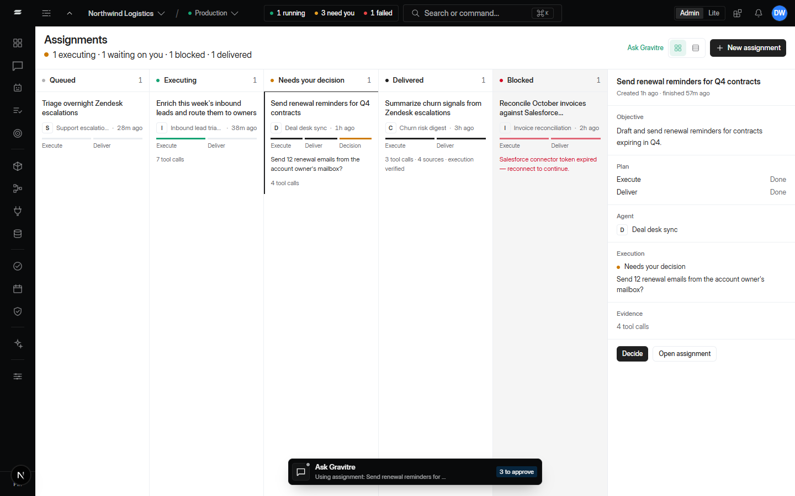

## Intelligence

| Before | After |
|---|---|
| 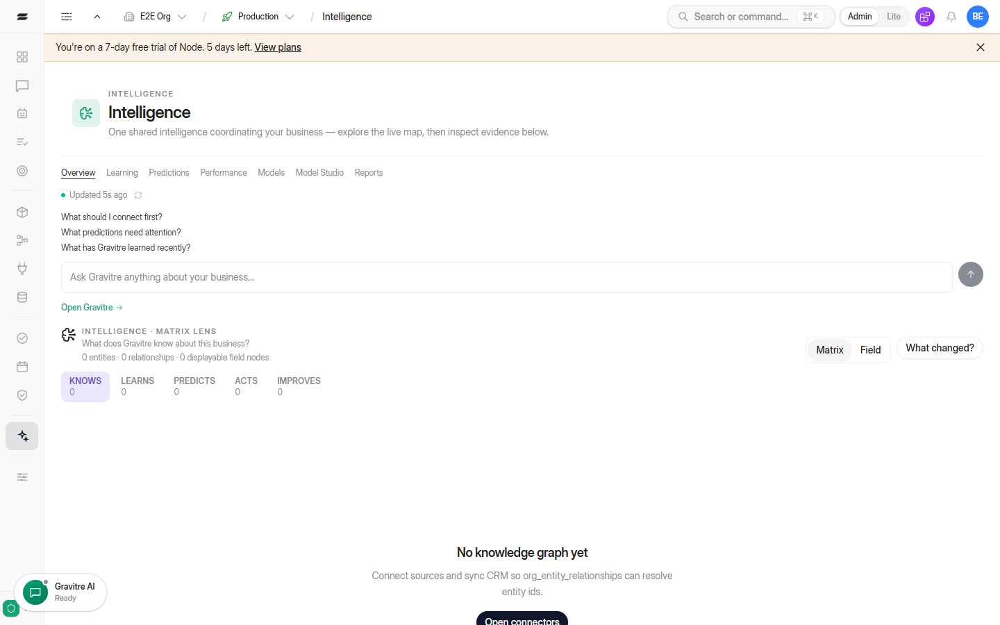 | 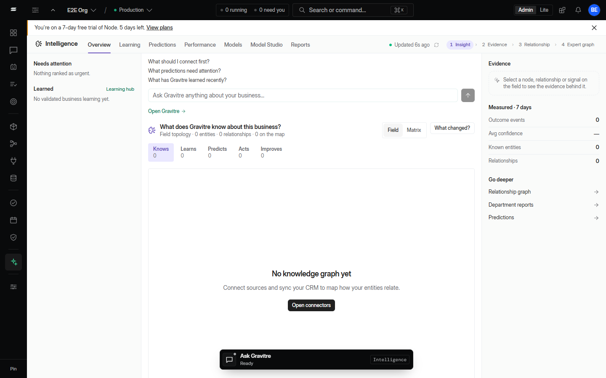 |

## Global shell

| Before | After |
|---|---|
| 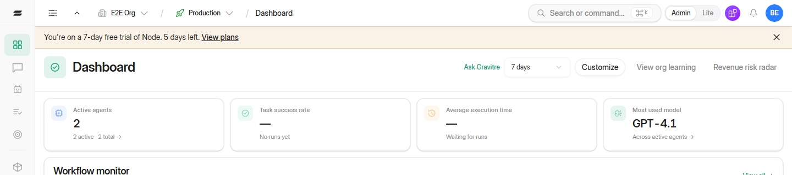 | 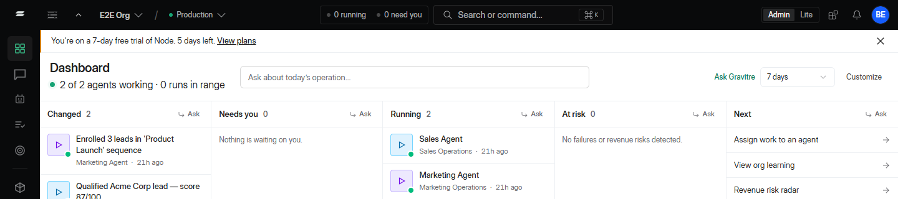 |
